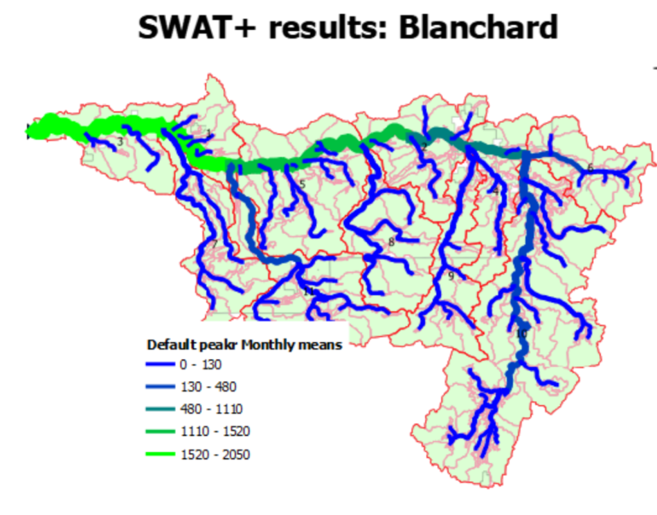
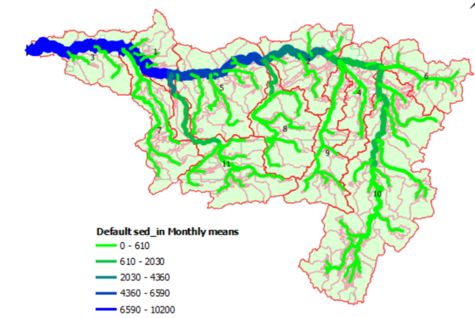
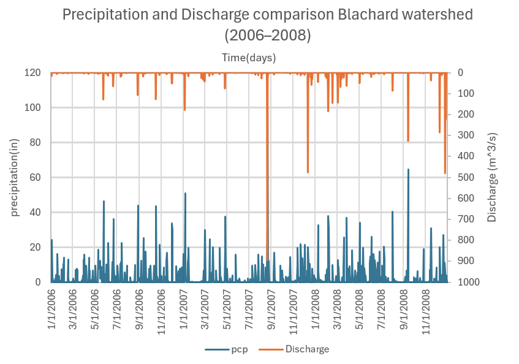
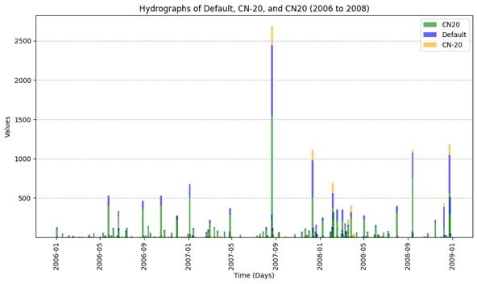
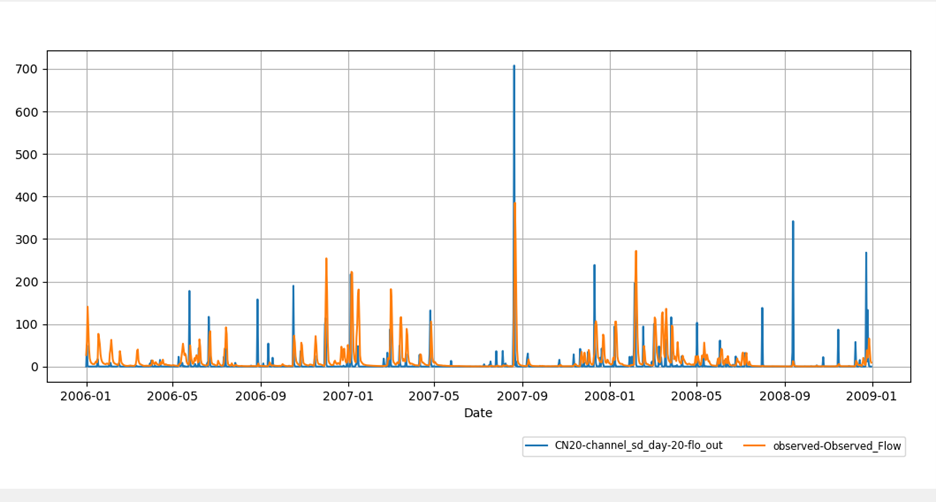
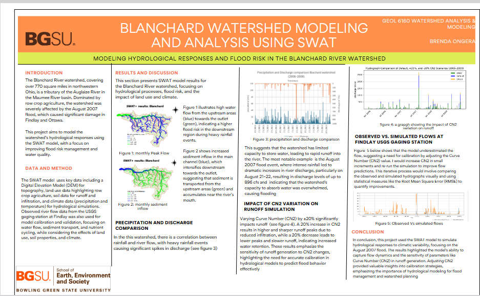

# 🌊 Blanchard Watershed Modeling and Analysis using SWAT

## 📍 Overview
This project focuses on modeling hydrological responses and flood risk in the Blanchard River watershed in northwestern Ohio using the SWAT (Soil and Water Assessment Tool) model. The study evaluates how rainfall, land use, and soil properties influence runoff, sediment transport, and flood behavior.

---

## 🛠️ Tools Used
- QGIS  
- QSWAT+  
- Hydrological modeling techniques  

---

## 📊 Data Used
- Digital Elevation Model (DEM)  
- Land use data (row crop agriculture)  
- Soil data  
- Climate data (precipitation and temperature)  
- USGS streamflow data (Findlay gaging station)  

---

## 🔍 Methodology
The SWAT model was used to simulate key hydrological processes including:
- Surface runoff  
- River discharge  
- Sediment transport  
- Nutrient cycling  

Model calibration was performed using observed streamflow data. The Curve Number (CN2) parameter was adjusted iteratively to improve agreement between simulated and observed flows.

---

## 🗺️ Spatial Analysis Outputs

### 1. Peak Flow Distribution
This map shows  high water flow from the upstream areas (blue) towards the outlet (green), indicating a higherflood risk in the downstream region during heavy rainfall events.

---

### 2. Sediment Transport Patterns
This map shows increased sediment inflow in the main channel (blue), which intensifies downstream towards the outlet, suggesting that sediment is transported from the upstream areas (green) and accumulates near the river’s mouth

---

## 📈 Hydrological Analysis

### 3. Precipitation vs Discharge
This graph shows the relationship between rainfall and river discharge. Heavy rainfall events lead to significant spikes in discharge, indicating rapid runoff response.

---

### 4. Impact of CN2 on Runoff
Varying the Curve Number (CN2) significantly affects runoff behavior:
- Increasing CN2 → higher and sharper runoff peaks  
- Decreasing CN2 → lower peaks and improved infiltration  

---

### 5. Observed vs Simulated Flow
Comparison between observed and simulated streamflow shows initial underestimation by the model, requiring calibration.

---

## 🔑 Key Findings
- Strong correlation exists between rainfall and river discharge  
- The watershed has limited water storage capacity, leading to rapid runoff  
- Downstream areas are at higher flood risk  
- Sediment transport increases toward the watershed outlet  
- Model sensitivity to CN2 highlights the importance of calibration  

---

## 📌 Conclusion
This project demonstrates the importance of hydrological modeling for flood risk assessment and watershed management. The SWAT model effectively captures flow dynamics and provides insights into runoff behavior under varying conditions.

---

## 📂 Project Files
- Blanchard watershed analysis report (PDF)  
- Map outputs and hydrological graphs  

---

## 📄 Full Project Poster
The complete project poster summarizing the study is shown below:

---

## 👩🏽‍💻 Author
Brenda Ongera  
Geospatial Data Scientist | GIS Analyst | Remote Sensing & Environmental Modeling
