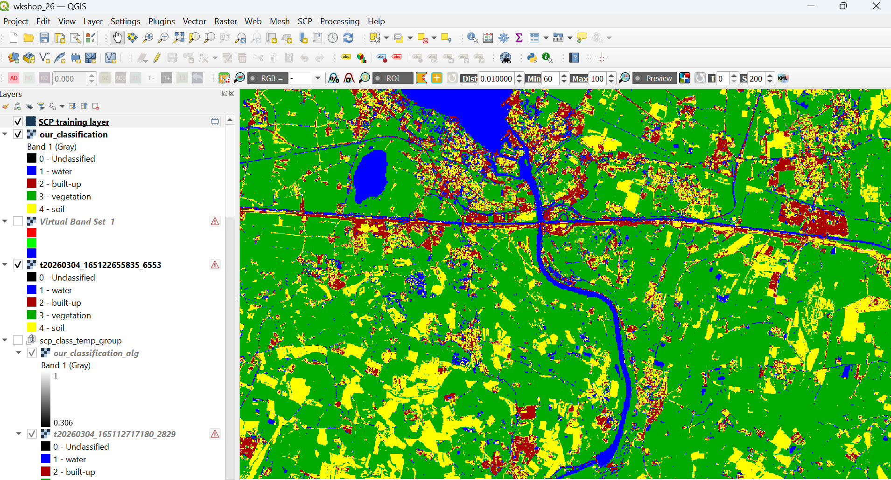

# 🌍 Land Use Land Cover (LULC) Classification using QGIS

## 📌 Overview
This project demonstrates land use land cover (LULC) classification using QGIS and the Semi-Automatic Classification Plugin (SCP).

The classification identifies major land cover classes including:
- Water  
- Built-up areas  
- Vegetation  
- Soil  

## 🛠️ Tools Used
- QGIS  
- Semi-Automatic Classification Plugin (SCP)  

## 🔍 Methodology
- Loaded satellite imagery into QGIS  
- Created band set using SCP  
- Defined training samples (ROIs) for each class  
- Applied supervised classification (e.g., Random Forest / Maximum Likelihood)  
- Generated final classified map  

## 🗺️ Output
Below is the final LULC classification result:

## 📌 Notes
- Training samples were manually created for each class  
- Classification accuracy depends on quality of training data  
